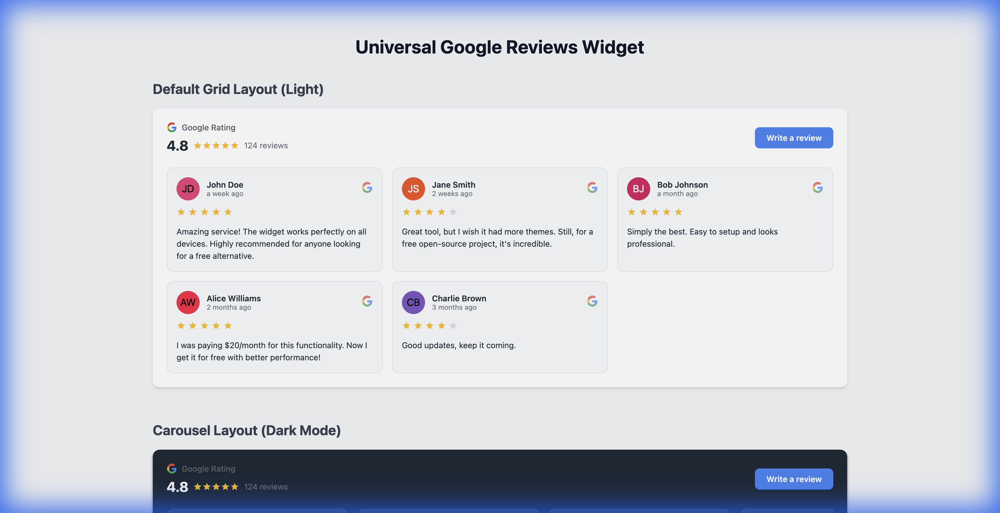

# Universal Google Reviews Widget (Free & Open Source)

[](https://opensource.org/licenses/MIT)
[](https://anouarlab.fr)

A zero-cost, high-performance, and privacy-friendly alternative to paid Google Reviews widgets (like Elfsight).  
Built for developers who want full control, **no monthly fees**, and zero impact on their site's initial load time.

**Brought to you by [AnouarLab.fr | SEO and CRO consulting](https://anouarlab.fr).**



## 🚀 Features

-   **💸 100% Free**: Uses your own Google API Key (within the free tier) + GitHub Actions for caching.
-   **⚡ Universal**: Works with React, Vue, Astro, WordPress, Shopify, or plain HTML.
-   **🎨 Customizable**: Native "Grid" and "Carousel" layouts. Supports Dark Mode.
-   **🔍 S.E.O. Ready**: Automatically injects `LocalBusiness` Schema.org JSON-LD for rich snippets.
-   **📱 Responsive**: Mobile-first design with masonry grid layout.
-   **🌍 Multi-Language**: Built-in support for 12+ languages (EN, FR, ES, DE, IT, JP, etc.).
-   **✨ Premium Feel**: Staggered fade-in animations and "Read More" truncation for long reviews.

## 📚 Documentation

Detailed documentation is available in the `docs/` directory:

-   [**📦 Installation Guide**](docs/INSTALLATION.md): Step-by-step setup (Fork, Secrets, Embed).
-   [**⚙️ Configuration**](docs/CONFIGURATION.md): API reference for attributes (`src`, `theme`, `layout`).
-   [**🧠 Advanced Usage**](docs/ADVANCED.md): Custom CSS styling, manual JSON hosting, and troubleshooting.

## 🛠 How It Works

Unlike other widgets that hit the Google API on every page load (costing money and slowing down your site), this solution uses a **Static Data Strategy**:

1.  **The Backend (GitHub Actions)**: A scheduled workflow runs daily, fetches top reviews from Google, and saves them to a static `reviews.json` file in your repository.
2.  **The Frontend (Web Component)**: A lightweight custom element `<google-reviews-widget>` fetches that static JSON file and renders it. **Zero API calls from your visitors' browsers.**

## 🏗 Development

```bash
# Install dependencies
npm install

# Start local dev server & playground
npm run dev

# Build for production
npm run build
```

## 🤝 Contributing

Contributions are welcome! Please feel free to submit a Pull Request.

## 📄 License

MIT © [AnouarLab.fr](https://anouarlab.fr)
