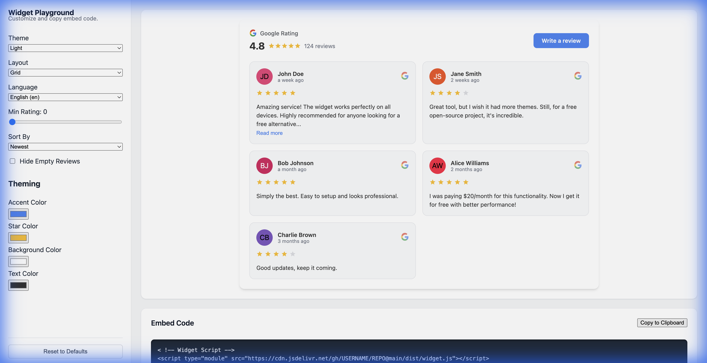

# 🧠 Advanced Usage & Customization

## Custom Styling (CSS)

The widget uses **CSS Variables**, making it easy to override colors to match your brand without touching the source code.

Add specific CSS rules targeting the widget in your global spreadsheet:

```css
google-reviews-widget {
  /* Backgrounds */
  --bg-color: #ffffff;
  --card-bg: #f9fafb;
  
  /* Typography */
  --text-color: #1f2937;
  font-family: 'Open Sans', sans-serif; /* Override font */
  
  /* Accents */
  --accent-color: #ff5722; /* Change "Write a Review" button color */
  --star-color: #fbbc05;
}
```

## Manual Usage (No GitHub Actions)

If you prefer not to use GitHub Actions, you can generate the `reviews.json` file using your own backend or manual script.

1.  **JSON Format**: Ensure your JSON matches this structure:
    ```json
    {
      "name": "Business Name",
      "rating": 4.8,
      "user_ratings_total": 120,
      "url": "https://maps.google.com/...",
      "address": "123 Main St",
      "reviews": [
        {
          "author_name": "John Doe",
          "author_url": "...",
          "profile_photo_url": "...",
          "rating": 5,
          "relative_time_description": "2 weeks ago",
          "text": "Great service!",
          "time": 1690000000
        }
      ]
    }
    ```
2.  **Host**: Upload this file anywhere (AWS S3, your own server, etc.).
3.  **Point**: update the `src` attribute of the widget:
    ```html
    <google-reviews-widget src="https://myserver.com/reviews.json"></google-reviews-widget>
    ```

## 🛠️ Developer Playground

The project includes a built-in interactive playground at `index.html` (accessible via `npm run dev`).

Use it to:
1.  **Visually configure** your widget (Theme, Layout, Language).
2.  **Test specific scenarios** (e.g., "What does it look like with only 5-star reviews?").
3.  **Generate production-ready HTML** code snippets.
4.  **Reset** to defaults instantly to start over.



## Browser Support

The widget is built as a standard Web Component (Custom Element). It works in all modern browsers:
-   Chrome / Edge
-   Firefox
-   Safari
-   Mobile Browsers (iOS/Android)
