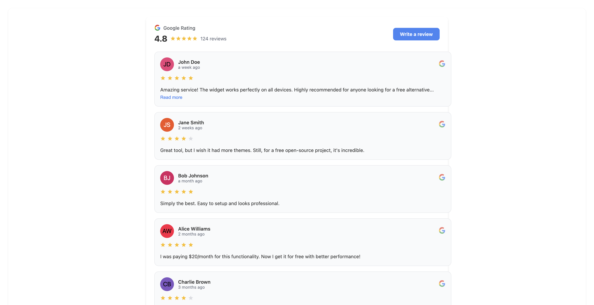
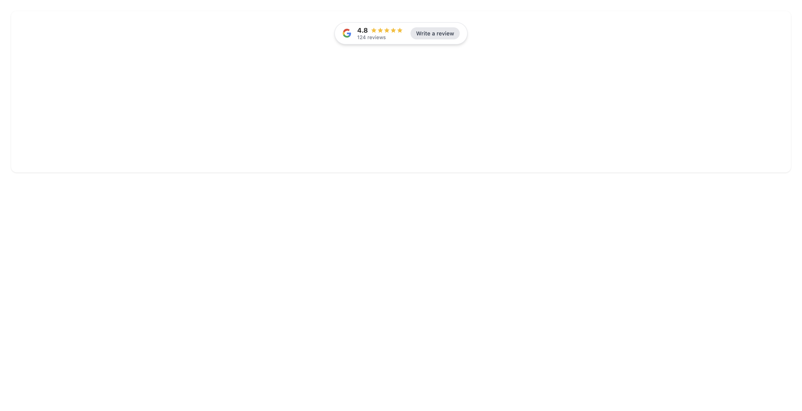

# ⚙️ Configuration Reference

The `<google-reviews-widget>` custom element accepts several attributes to control its behavior and appearance.

## Attributes

| Attribute | Type | Default | Description |
| :--- | :--- | :--- | :--- |
| `src` | `string` | `reviews.json` | **Required.** The URL to the JSON file containing the review data. |
| `theme` | `string` | `light` | Sets the color scheme. Options: `light`, `dark`. |
| `layout` | `string` | `grid` | Sets the display layout. Options: `grid` (masonry), `carousel` (horizontal slider). |
| `lang` | `string` | `en` | Sets the language. See [Supported Languages](#supported-languages) below. |
| `sort` | `string` | `newest` | Sort order: `newest`, `oldest`, `highest`, `lowest`, `random`. |
| `min-rating` | `number` | `0` | Filter reviews below this rating (e.g., `4`). |
| `hide-empty` | `boolean` | `false` | If present, hides reviews with no text. |
| `accent-color`| `color` | `#4285f4` | Hex code for buttons and links. |
| `star-color` | `color` | `#FBBC05` | Hex code for star icons. |
| `bg-color` | `color` | `#ffffff` | Hex code for the card background. |
| `text-color` | `color` | `#333333` | Hex code for the text color. |

## Supported Languages

The `lang` attribute accepts the following 2-letter codes:

| Code | Language |
| :--- | :--- |
| `en` | English (Default) |
| `fr` | French |
| `es` | Spanish |
| `de` | German |
| `it` | Italian |
| `pt` | Portuguese |
| `nl` | Dutch |
| `pl` | Polish |
| `ru` | Russian |
| `ja` | Japanese |
| `ko` | Korean |
| `zh` | Chinese |

## Examples

### Dark Mode Carousel
```html
<google-reviews-widget 
  src="path/to/reviews.json" 
  theme="dark" 
  layout="carousel">
</google-reviews-widget>
```

### Light Mode Grid

```html
<google-reviews-widget 
  src="path/to/reviews.json" 
  theme="light" 
  layout="grid">
</google-reviews-widget>
```

### List Layout

```html
<google-reviews-widget 
  src="path/to/reviews.json" 
  layout="list">
</google-reviews-widget>
```

### Badge Layout

```html
<google-reviews-widget 
  src="path/to/reviews.json" 
  layout="badge">
</google-reviews-widget>
```
